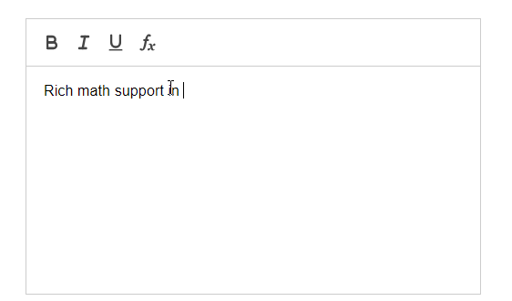
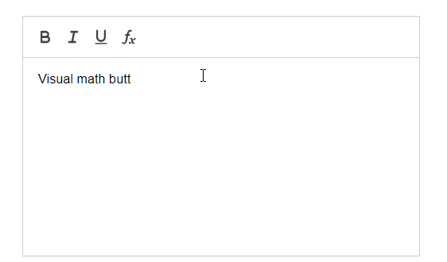

# MathQuill 4 Quill

[](https://github.com/c-w/mathquill4quill/blob/master/LICENSE.txt)

## What's this?

This module adds support for rich math authoring to the
[Quill](http://quilljs.com/) editor.



[Live demo](https://c-w.github.io/mathquill4quill/)

## Usage example

This module depends on
[MathQuill](http://docs.mathquill.com/en/latest/Getting_Started/),
[Quill](https://quilljs.com/docs/quickstart/) and
[KaTeX](https://github.com/Khan/KaTeX#usage),
so you'll need to add references to their JS and CSS files in addition to
adding a reference to [mathquill4quill.js](https://github.com/c-w/mathquill4quill/blob/master/mathquill4quill.js).

Next, initialize your Quill object and load the formula module:

```javascript
// setup quill with formula support

var quill = new Quill('#editor', {
  modules: {
    formula: true,
    toolbar: [['formula']]
  },
  theme: 'snow'
});
```

Last step: replace Quill's native formula authoring with MathQuill.

```javascript
// enable mathquill formula editor

quill.enableMathQuillFormulaAuthoring();
```

### Custom operator buttons

You can also add in operator buttons (buttons that allow users not familiar with latex to add in operators/functions like square roots) to the editor by passing an `operators` variable to the `enableMathQuillFormulaAuthoring()` function. Example:

```javascript
quill.enableMathQuillFormulaAuthoring({
    operators: [["\\sqrt[n]{x}", "\\nthroot"], ["\\frac{x}{y}","\\frac"]]
});
```

The operators variable is an array of arrays. The outside array contains all of the different arrays which describe the operator buttons. The arrays inside of the main array consist of two values. The first value is the latex that gets rendered as the value on the button, and the second value is the latex that gets inserted into the MathQuill editor.



## Development setup

First, install the development dependencies:

```bash
npm install
```

You can now start the development server using `npm start`.

### Generating minified javascript files

After installing the development dependencies, you can run `npm run build` which will generate a minified version of `mathquill4quill.js` called `mathquill4quill.min.js` that can be included in your webpage by substituting the minified file for the non-minified file directly.
